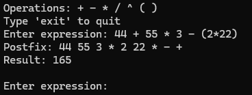

# Shunting yard algorithm
This is a console-based calculator implemented in C++ that can parse and evaluate arithmetic expressions. It uses the Shunting Yard algorithm to convert infix expressions into postfix notation and then evaluates the postfix expression to produce a result.

## The calculator supports:

Addition (+)

Subtraction (-)

Multiplication (*)

Division (/)

Exponentiation (^)

Multi-digit numbers and decimals

Parentheses for grouping

## Features

Converts infix expressions (like 12 + 34 * 5.6) into postfix notation (12 34 5.6 * +)

Evaluates the resulting postfix expression to produce a numeric result

## Example

## Notes

- Currently supports only numeric constants (multi-digit integers and decimals)

- Functions and commas can be added later if needed

- Operator precedence follows standard PEMDAS rules
